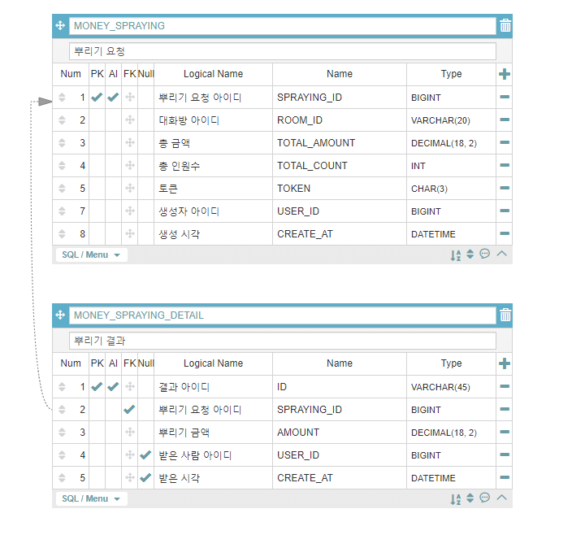

# KPay-API
카카오페이가 제공하는 머니 뿌리기 기능의 간소화된 REST API 구현


## 요구 사항
* 뿌리기, 받기, 조회 기능을 수행하는 REST API 를 구현합니다.
* 요청한 사용자의 식별값은 숫자 형태이며 "X-USER-ID" 라는 HTTP Header로
전달됩니다.
* 요청한 사용자가 속한 대화방의 식별값은 문자 형태이며 "X-ROOM-ID" 라는
HTTP Header로 전달됩니다.
* 모든 사용자는 뿌리기에 충분한 잔액을 보유하고 있다고 가정하여 별도로
잔액에 관련된 체크는 하지 않습니다.
* 작성하신 어플리케이션이 다수의 서버에 다수의 인스턴스로 동작하더라도 기능에
문제가 없도록 설계되어야 합니다.
* 각 기능 및 제약사항에 대한 단위테스트를 반드시 작성합니다.

## 진행 과정
1. 데이터 모델링
   * 전달받은 문서 내 요구 사항을 분석하여 아래와 같이 테이블 모델링을 진행 함
   * ERD
      
      
   
2. API 기능 명세
   * URL 설계 
   * 요청 데이터 및 응답 데이터 규격 정의
3. 구현 및 테스트
   * 유닛 테스트와 함께 세부 구현 작업 진행

## API 
### 1. 뿌리기 API
기능: 뿌릴 금액과 뿌릴 인원을 요청값으로 받아 대화방 참여자에 뿌립니다.

Request 
  * URI: /v1/kpay/moneyspraying
  * Http Method: POST
  * Headers: 
      * X-USER-ID: 뿌리는 사용자 아이디
      * X-ROOM-ID: 뿌릴 대화방 아이디
  * Body: 
      * totalAmount: 뿌리는 총 금액
      * totalCount: 뿌릴 인원 수
```
{
    "totalAmount": "10000",
    "totalCount": "4"
}
```

Response
  * 결과코드와 뿌리기 건에 해당하는 고유 토큰 문자열을 반환합니다.
```
{
    "code": "SUCCESS",
    "result": {
        "token": "c50"
    }
}
```


### 2. 받기 API
기능: 참여한 대화방에 뿌려진 돈을 받습니다.

Request 
  * URI: /v1/kpay/takeMoney
  * Http Method: POST
  * Headers: 
      * X-USER-ID: 뿌리는 사용자 아이디
      * X-ROOM-ID: 뿌릴 대화방 아이디
      * X-TOKEN: 뿌리기 요청건에 대한 고유 토큰
      * Content-Type: application/json
  
Response
  * 결과코드와 받은 돈의 액수를 전달합니다.
  * 샘플 응답
```
{
    "code": "SUCCESS",
    "result": {
        "amount": 839.00
    }
}
```

### 3. 조회 API
Request 
  * URI: /v1/kpay/describe
  * Http Method: GET
  * Headers: 
      * X-USER-ID: 뿌리는 사용자 아이디
      * X-ROOM-ID: 뿌릴 대화방 아이디
      * X-TOKEN: 뿌리기 요청건에 대한 고유 토큰
      
Response
  * 토큰에 해당하는 뿌리기 건의 현재 상태를 응답값으로 내려줍니다.
     * 뿌린 시각, 뿌린 금액, 받기 완료된 금액
     * 받기 완료된 정보의 배열 ([받은 금액, 받은 사용자 아이디] 리스트)
  * 샘플 응답
```
{
    "code": "SUCCESS",
    "result": {
        "details": [
            {
                "amount": 839.00,
                "userId": 0
            },
            {
                "amount": 6115.00,
                "userId": 0
            },
            {
                "amount": 2882.00,
                "userId": 0
            },
            {
                "amount": 164.00,
                "userId": 0
            }
        ],
        "info": {
            "sprayingId": 1,
            "roomId": "R01",
            "totalCount": 4,
            "totalAmount": 10000.00,
            "remitAmount": 0.00,
            "token": "18a",
            "userId": 22,
            "createAt": "2020-06-27 13:28:51.907"
        }
    }
}
```

### 4. 공통 에러 응답
Response
  * 결과코드와 에러 메시지를 반환합니다.
  * 샘플 응답
```
{
    "code": "FAIL",
    "message": "뿌리기 당 한 사용자는 한번만 받을 수 있습니다"
}
```

## 도출된 이슈 목록 및 해결 전략
* 짧은 일정
  * 3일이 되지 않는 기간 중 업무 시간 외를 활용하여 작업을 진행해야 하는 매우 긴급한 일정
  * 기술 선택 시 구현을 가장 빠르게 할 수 있는 스킬들로 선택
  

## 빌드 및 실행 방법
1. 원하는 경로에서 소스코드를 다운로드합니다.
```
git clone https://github.com/yeonhooo/kpay-api.git
```
2. 다운로드 폴더의 하위 경로로 이동하여 실행 파일을 생성합니다.
```
cd kpay-api
mvnw package
```
3. 위의 단계까지 마치면 target 폴더에 실행가능한 jar파일이 생성됩니다. 이 파일을 이용하여 애플리케이션을 구동합니다.
```
cd target
java -jar kpay-api-0.0.1-SNAPSHOT.jar
```

## 생각해볼만한 것들
* 토큰은 고유한가?
  * 요구사항 중 하나로, 토큰은 3자리의 문자열로 구성되며 고유해야합니다.
    * 다수 서버에 다수 인스턴스로 동작할 경우를 고려하여, 어플리케이션 레벨에서의 토큰 생성 방법은 제외하였습니다(중복 발생 여지 있음).
    * 외부에 고유한 값을 얻기 위해 DB의 UUID 를 사용하였습니다. 
    * 단, 3자리만 사용하기때문에 낮은 확률로 중복 가능성이 있습니다. 이 문제의 경우, 요구사항의 변경이 필요해보입니다(3자리 문자열이 아닌 그 이상으로 변경). 
* 어플리케이션이 대량의 트래픽에도 무리가 없는가?
  * 현재의 어플리케이션은 Stateless 하게 작성되었습니다.
    * 이에 대량 트래픽 시에 다수의 인스턴스로 수평 확장이 가능합니다. 단, 인스턴스는 확장가능하더라도 사용하는 다른 기술들의 확장이 어려울 수 있습니다.
    * e.g) 관계형 DB의 경우, 즉각적인 확장이 어려울 수 있습니다. 
  * 캐시 도입 여부 고려
    * 이에 병목이 발생할 것으로 예상되는 구간 사이에 캐시를 두는 방법을 고려할 수 있습니다(1차 캐시, 2차 캐시 및 CDN 등)
* URI 재정의
  * 좀 더 Restful 한 URI 정의
